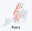
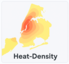
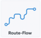
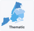

# NYC GIS Map Gallery — Portfolio Case Study

> Let maps speak for your business. From retail site selection to mobility planning, I turn **spatial data into decisions** with **ArcGIS Pro + Python**.

[](https://chatgpt.com/g/g-p-688dcaa9fa248191a78f997ff15a869f-gisxiang-guan-nei-rong/c/689766b2-4b8c-8323-91b5-04719d279ef7?model=gpt-5-thinking#tech-stack)
 [](https://chatgpt.com/g/g-p-688dcaa9fa248191a78f997ff15a869f-gisxiang-guan-nei-rong/c/689766b2-4b8c-8323-91b5-04719d279ef7?model=gpt-5-thinking#tech-stack)

## Table of Contents

- [Highlights](#highlights)
- [Quick Preview](#quick-preview)
- [Map Gallery](#map-gallery)
- [Flagship Project: NYC Housing Price Forecasting (AI + GIS)](https://github.com/Fang-M-Xu/gis-housing-forecast)
- [Deliverables & Scope](#deliverables--scope)
- [Tech Stack](#tech-stack)
- [Repository Structure](#repository-structure)
- [Work With Me](#work-with-me)
- [License & Data Notice](#license--data-notice)
- [FAQ](#faq)

✳️ Looking for the **NYC Housing Price Forecasting (AI + GIS)** case? It now lives in a dedicated repo: `Fang-M-Xu/gis-housing-forecast`.

------

## Highlights

- **See spatial patterns at a glance**: Heat/Density maps surface hotspots for site selection, public safety, and risk.
- **Business‑first cartography**: Store networks, routing plans, and thematic maps aligned to commercial and public‑sector needs.
- **Professional map craftsmanship**: Built in ArcGIS Pro; consistent palette, legends, scale bars, and labeling.

## Quick Preview

| Map Type                                 | Preview                                                      |
| ---------------------------------------- | ------------------------------------------------------------ |
| Point Map (retail chains)                |  |
| Heat/Density (population / incidents)    |  |
| Route/Flow (tour itinerary)              |  |
| Thematic (terrain / hydrology / climate) |  |

> 📂 Detailed write‑ups and full‑res exports:
> - [Point Map](maps/point-map/README.md)
> - [Heat/Density](maps/heat-density/README.md)
> - [Route/Flow](maps/route-flow/README.md)
> - [Remote Sensing](maps/thematic/README.md)


## Map Gallery (Static/Thematic)

- **Point Map**: Clear visibility into store/facility footprint; ideal for network strategy and placement.
- **Heat/Density**: Identify hotspots and spatial clustering of people or events.
- **Route/Flow**: Connect attractions; optimize paths for experience and efficiency.
- **Thematic**: Research‑grade overlays (terrain, hydrology, climate) for deep‑dive analysis.

👉 Each category includes **design rationale, styling parameters, export specs, sample deliverables**.

------

## Deliverables & Scope

**Standard**

- High‑resolution maps (PNG/PDF/SVG)
- ArcGIS Pro project/layer files (`.aprx`/`.lyrx`) and style library
- Method summary with legend/label standards

**Optional**

- Brand color adaptation; bilingual layouts
- Report templates (PPT/Notion); asset pack (covers/GIFs)

------

## Tech Stack

- **GIS**: ArcGIS Pro (Overlay, Buffer, Zonal Statistics, Near, Hotspot Analysis)
- **Python**: `pandas`, `scikit-learn`、`random forest`
- **Export**: Hi‑res figures with unified legends/scale/labels; clean layout and whitespace

------

## Repository Structure

```text
.
├─ README.md                      # Main showcase (this page)
├─ logo/                        
├─ maps/
│  ├─ point-map/README.md         # Point map case
│  ├─ heat-density/README.md      # Heat/Density case
│  ├─ route-flow/README.md        # Route/Flow case
│  └─ thematic/README.md          # Thematic remote sensing case

```

------

## Work With Me

- **Discovery**: Share your use case (industry/geo/goals), channels (report/web/poster), and target date.
- **Engagements**: cartography package / GIS analytics / end‑to‑end case co‑creation
- **Platforms**: Fiverr / Upwork (replace with your profile links)

------

## License & Data Notice

- **Data sources:** [NYC Open Data](https://opendata.cityofnewyork.us/), [NYC Department of City Planning — Neighborhood Tabulation Areas datasets](https://www.nyc.gov/content/planning/pages/resources/datasets/neighborhood-tabulation),  [Kaggle](https://www.kaggle.com/),and [US Census Bureau](https://www.census.gov/en.html).
- Maps and figures in this repository are derived from the above public datasets and are provided **for demonstration/portfolio purposes only**. **Not for commercial use.**
- Before reuse, review and comply with each dataset’s license and terms; retain source attribution on derived outputs.
- No affiliation or endorsement by NYC agencies or Kaggle is implied.
- All maps and data in this repository are created with **properly licensed ArcGIS Pro** software.
------
### Copyright & Usage

- All finished maps, documentation, and derivative files in this repository are copyrighted by the project author(s) and **prohibited from commercial use**. For personal, organizational, or academic reference only.
- Please attribute this project and data sources when quoting.
- Do **not** use this repository content in violation of laws, regulations, or third-party rights.

### Liability

- The author(s) disclaim any responsibility for risks or consequences arising from the use of this repository.

## FAQ

**Q1: I only have CSV/Excel—can you map it?** Yes. I build spatial fields and clean data to produce ready‑to‑map layers.

**Q2: Can we start without complete data?** Yes. Validate on a small sample, then scale.

**Q3: Can you provide bilingual deliverables?** Yes. English/Chinese with brand‑compliant templates.
