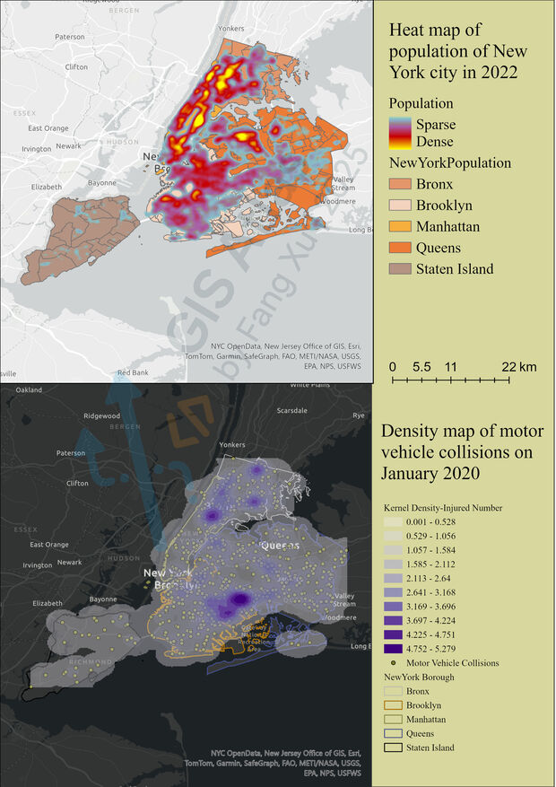

## Heat/Density — Population & Traffic Incident Hotspots

> **Business value**: spot hotspots at a glance; reveal the spatial story behind the data.

### Overview

- Examples: NYC population; traffic incident hotspots.
- Suggested uses: urban planning, public safety/insurance, trade area insights.

### Design Notes
- Data: population survey points (CSV), NTA polygons (Neighborhood Tabulation Areas), and 2020 Motor Vehicle Collisions – Crashes (SHP with lon/lat).

- Basemap: Light/Dark Gray Canvas overlay NTA boundaries to foreground the heat/density surface.

- Population heatmap: Symbology → Heat Map; tune radius by scale, red→yellow→purple ramp; stretch min/max to emphasize cores.

- Collision density: Spatial Analyst → Kernel Density; Weight field = casualties; pick Cell Size for street‑level hotspots; project data to a unified metric CRS for analysis.

### Export Specs

- `300 DPI` JPG ; A4 layouts; light/dark variants.

### Preview

### Deliverables

- Population heat maps.
- Motor collisions density maps.The darker the color, the greater the number of people injured in the accident.
