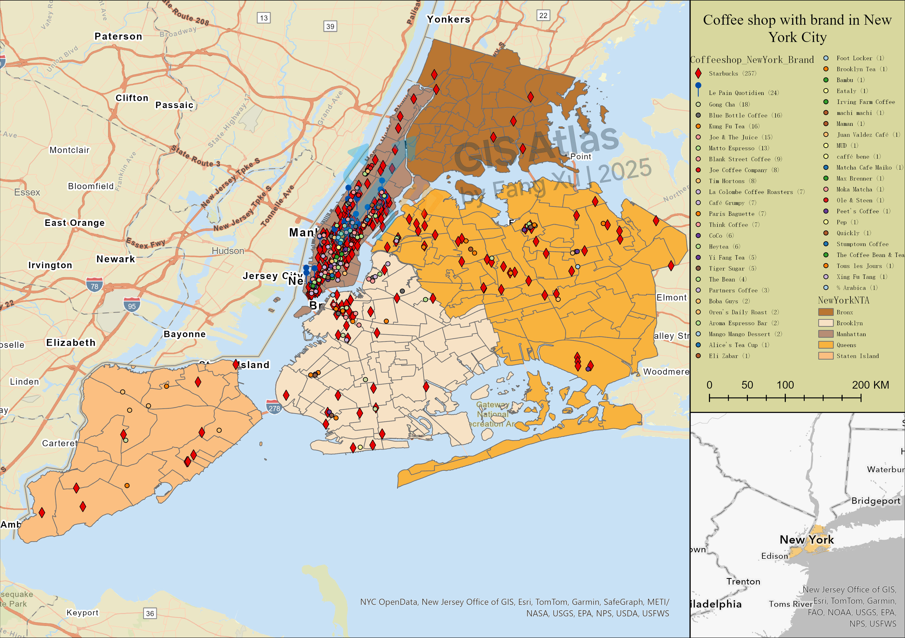

## Point Map — Coffee Shop Distribution

> **Business value**: instantly understand store coverage to guide network strategy and market assessment.

### Overview

- Example: Brand‑colored points for coffee chains across NYC (logos optional), with borough basemap.
- Suggested uses: report figures, investor materials, ops dashboards.

### Design Notes

- Symbology: categorical points (brand color + unified circle/icon). Minimum label size: 10pt&4pt; avoid occlusion.
- Basemap: grayscale/low‑saturation to emphasize points; include scale bar and legend.
- Labels: annotate districts and count; keep legend groupings clear.

### Export Specs

- `300 DPI` JPG; A4 layouts; light variants.

### Preview

### Deliverables

- The distribution of branded coffee shops in New York City.