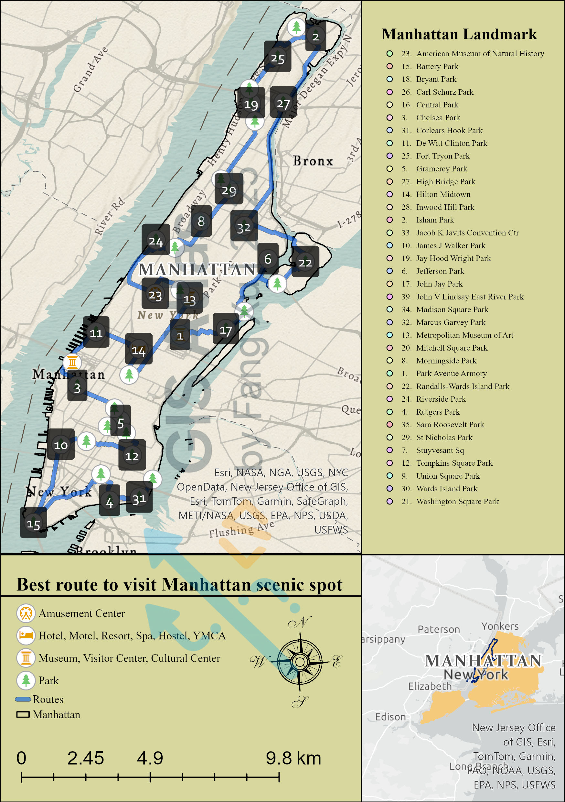
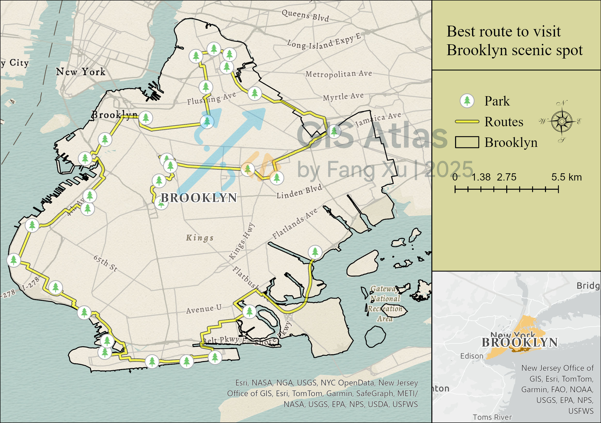
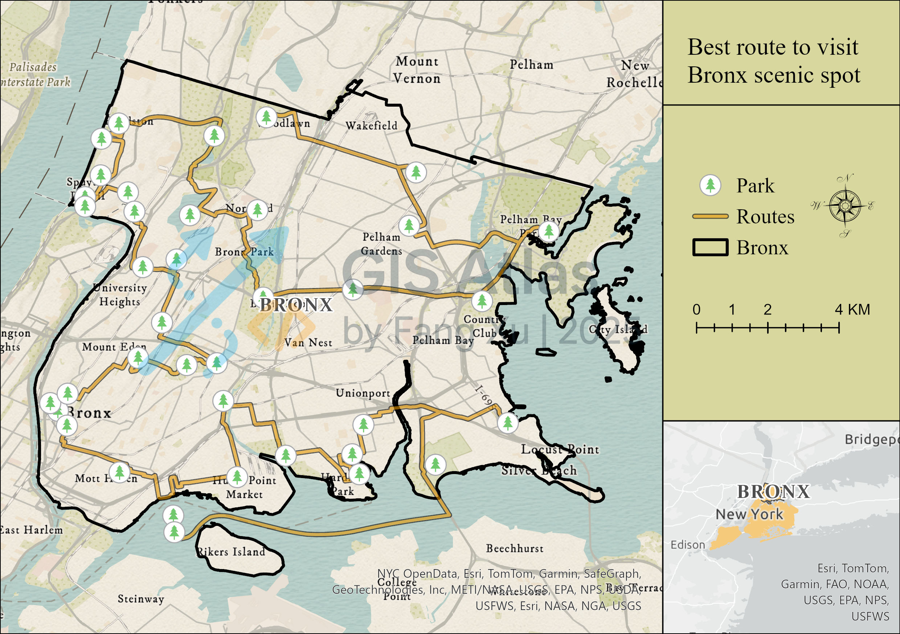
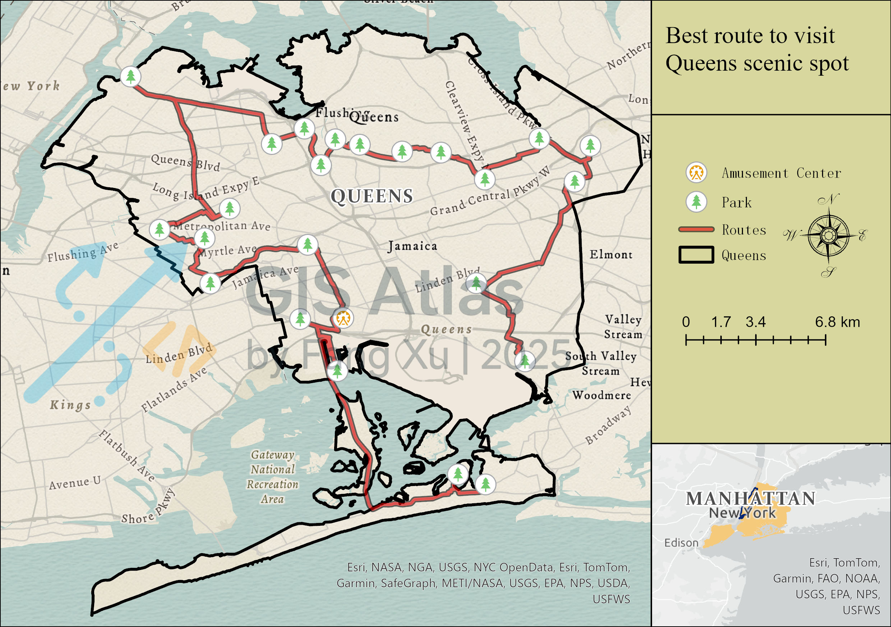
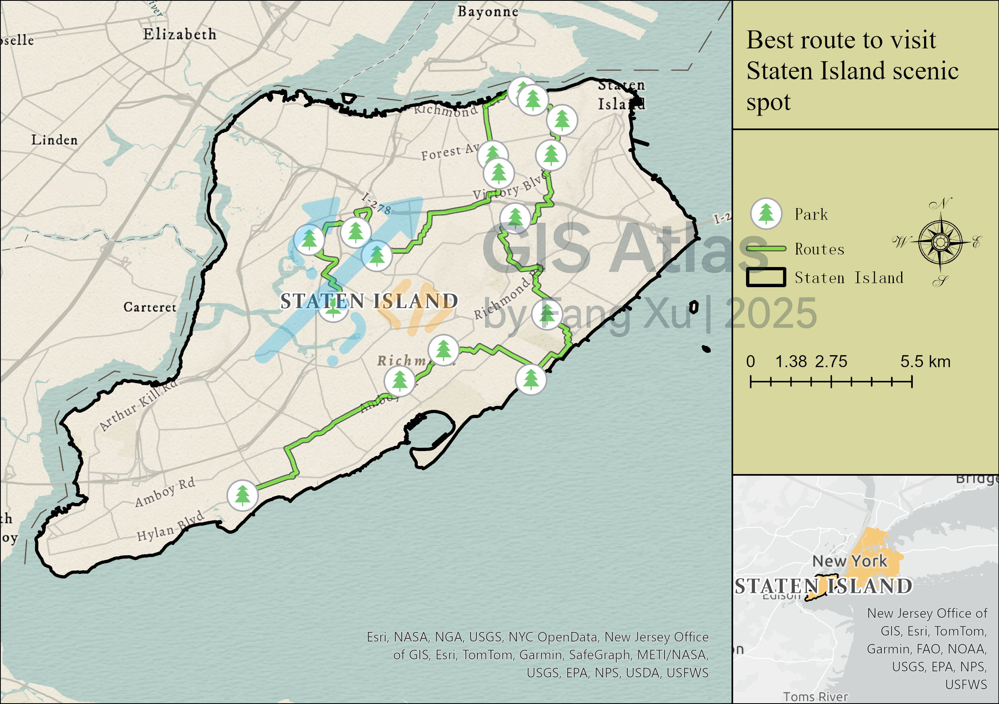

## Route/Flow — City Tour Itinerary

> **Business value**: user‑centric routing recommendations to boost efficiency and satisfaction.

### Overview

- Example: recommended tour route connecting attractions (driving).
- Suggested uses: travel guides, promotional posters, interactive mini‑apps.

### Design Notes

- Data: Use attractions datasets (CSV/SHP with name and longitude/latitude), the NYC road network (SHP), and borough boundaries, and project all layers to a common metric CRS to ensure consistent distance and area calculations.

- Network dataset: Create the network dataset, including the road line classes, enabling one-way and turn restrictions, and then building the .nd file.

- Route layer: Set up the Route layer via Network Analysis, adding the attractions as Stops (per-borough or citywide), choosing the Driving travel mode, specifying a representative departure time such as Saturday 14:00.

- Styling: The primary route is high-contrast.

- Finishing: Finish the layout by overlaying roads and NTA boundaries, and include a clear title, a legend, a scale bar,and a north arrow.

- Basemap: lightweight street map; avoid color clash with routes.

### Export Specs
- `300 DPI` JPG ; A4 layouts.

### Preview

### Deliverables

- Manhattan travel route map: Detailed listing of the names of every scenic spot along the best routes.
- Maps of general travel routes for the other four boroughs.