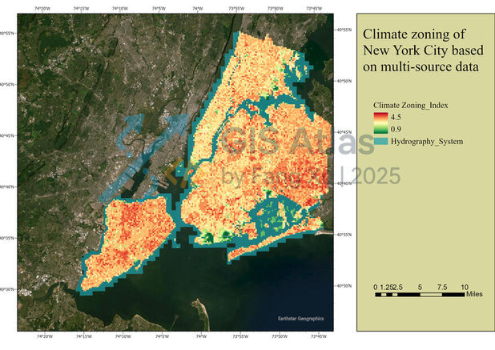
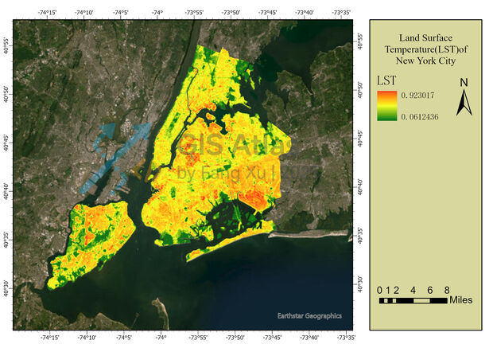
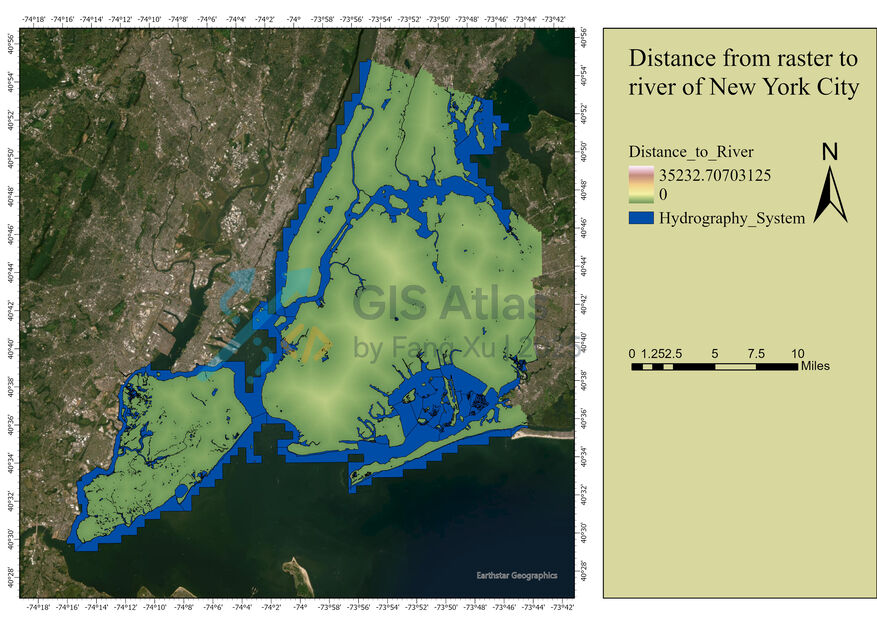

## Remote Sensing — Urban Climate Zones Map

> **Business value**: city-scale heat-risk screening and UHI mitigation insights for planning, resilience, and policy.

### Overview

- Example: summer Landsat 8/9 OLI/TIRS L2 LST with NDVI/DEM/hydro context, clipped to city/boroughs.
- Suggested uses: climate adaptation reports, heat-action plans, research figures, stakeholder briefings.

### Design Notes

- Use Landsat 8/9 Collection 2 Level-2 surface reflectance bands (B2–B7) and the LST band ST_B10, together with DEM, hydrology layers, a NewYork city boundary, and its neighborhood tabulation areas(NTA) boundaries; chose scenes to summer dates with cloud cover <10% to capture peak heat conditions.

- Clip all rasters to the city boundary, and project every layer to a consistent CRS so distances and areas are comparable across datasets. 

- Compute NDVI to map vegetation cover, and preview the result with a continuous color ramp to visually confirm green-space patterns. 

- Normalize LST to 0–1 using layer min/max (or Zonal Statistics) to enable fair weighting with other factors.

- Derive slope(elevation classes) from the DEM to contextualize heat accumulation. 

- Composite “heat-exposure” surface, by applying a Weighted Overlay that upweights thermal signal (e.g., LST 50%) and counterweights vegetation (NDVI 30%), with smaller weights for elevation (10%) and proximity to water (10%). 

- Symbolize the final LST or composite with a diverging ramp (hot red → cool blue). 

### Export Specs

- High‑res vector JPG; dark themes.

### Preview

### Deliverables

- Composite “heat-exposure” climate zoning with water buffer map.
- Land Surface Temperature(LST) map
- The influence radius of the water area map: the smaller the number, the closer the water is, and the greater the influence.